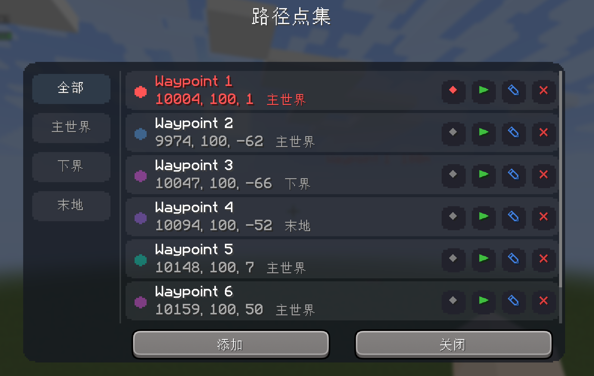
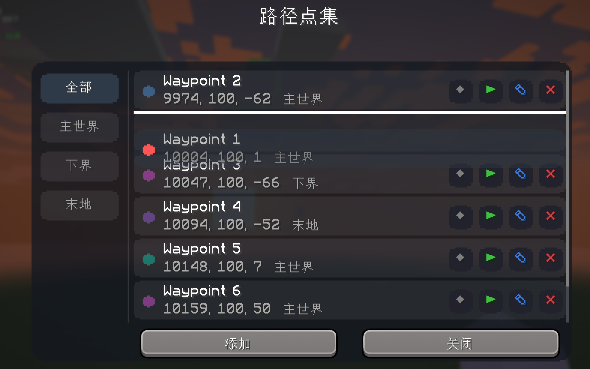
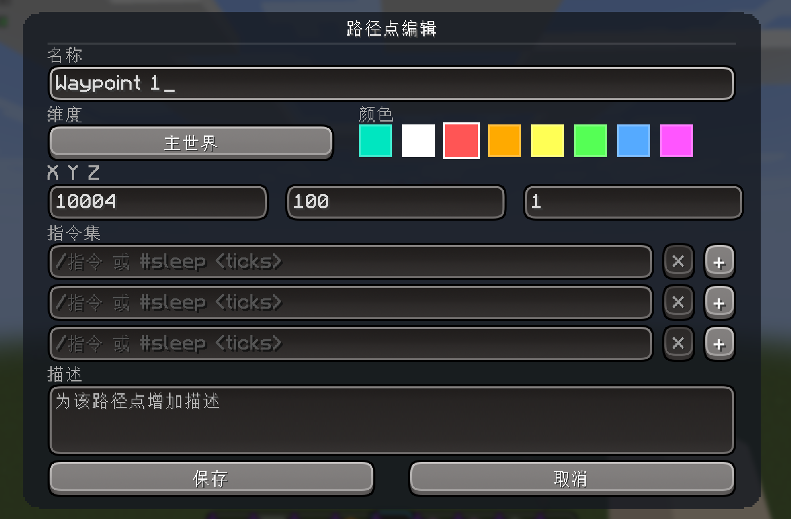
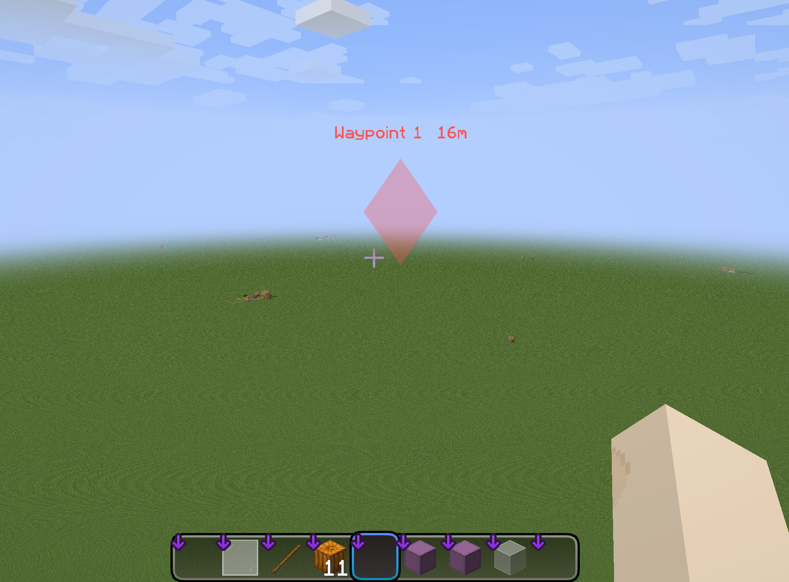
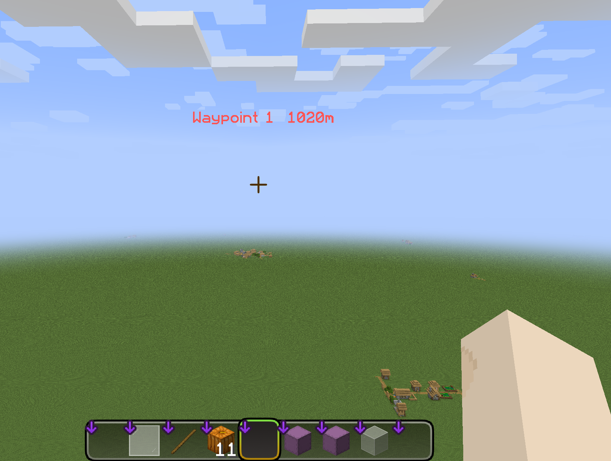
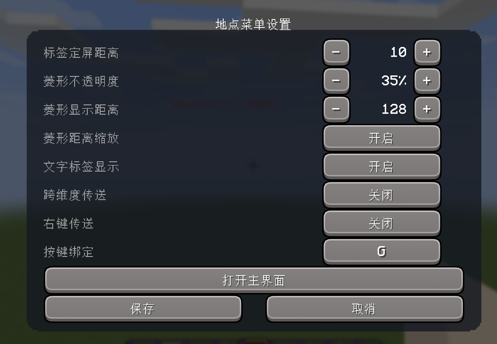

# Waypoint Menu（路径点集 / 地点菜单）

[English](README.en.md) · 中文

一个 **Fabric 客户端** Mod：记录地点坐标，为每个地点挂载一个「指令集」，并在世界中以 **菱形标记 + 名称/距离标签** 高亮显示目标地点。

- 🧭 记录当前位置，随手标记关键地点
- 🔷 世界内 3D 菱形标记 + 文字标签，无视遮挡、始终面向镜头
- 📡 超出视距也能看到远处地点的方位与距离（屏幕空间 HUD 标签）
- ⚡ 每个地点可携带一组指令，一键顺序执行（支持延时）
- 🗂 按维度筛选、拖拽排序、一键传送、自定义颜色

> 项目代码由 AI 生成。

---

## 目录

- [兼容版本](#兼容版本)
- [安装](#安装)
- [快速上手](#快速上手)
- [功能详解](#功能详解)
- [配置项](#配置项)
- [数据存储](#数据存储)
- [构建（开发者）](#构建开发者)
- [项目结构](#项目结构)

---

## 兼容版本

本 Mod 为 **26.1 与 26.2** 分别构建一个 Jar（共 2 个），每个 Jar 的 `mc_compat` 精确锁定单一版本，且均已实机验证：

| Minecraft | 对应 Jar | 状态 |
|-----------|----------|------|
| 26.1 | `waypointmenu-1.0.0+26.1.jar` | ✅ 已验证 |
| 26.2 | `waypointmenu-1.0.0+26.2.jar` | ✅ 已验证 |

> - 26.x 基于 Mojang 官方映射（Mojmap）构建，未混淆（unobfuscated），无需 remapJar。
> - ✅ 所有版本均已实机验证。

---

## 安装

### 前置依赖

- **Minecraft 26.1 / 26.2** 与对应版本的 **Fabric Loader**（推荐 `0.19.3`）
- **Fabric API**（本 Mod 使用 `fabric-rendering-v1` 做世界高亮渲染，需安装对应 MC 版本的 Fabric API）
- **Mod Menu**（可选，仅用于在游戏内打开配置界面）
- **Java**：Minecraft 26.x 需 Java 25

### 安装步骤

1. 按你的 MC 版本，从上表选择对应的 `waypointmenu-*.jar`。
2. 放入 `.minecraft/mods/`（需同装 Fabric Loader + Fabric API）。
3. 启动游戏，即可按 `G` 键打开地点列表。

---

## 快速上手

1. 按 **`G`** 打开地点列表。
2. 点击 **「添加」**，记录当前站立位置（自动打开编辑器）。
3. 在编辑器里设置名称、维度、颜色、坐标，可选填描述与指令集。
4. 保存后，点击该行或 `◆` 按钮开启高亮，世界内即可看到菱形 + 标签。
5. 点击行右侧 `▶` 执行该地点的指令集；右键行（若开启右键传送）可传送过去。

---

## 功能详解

### 地点列表



- 左侧**侧边栏**按维度筛选：`全部` / `主世界` / `下界` / `末地`。
- 每行显示：**颜色圆点**（青色 = 已高亮）、**名称**、**坐标 + 维度**、**描述摘要**。
- 行内操作按钮（右起）：
  - `◆` 切换高亮
  - `▶` 执行指令集
  - `✎` 编辑
  - `✕` 删除
- 行主体：**左键**切换高亮；**左键长按并拖动**移动列表项；**右键**传送（需开启右键传送）。
- 鼠标滚轮滚动列表。

### 拖拽排序



**左键长按并拖动**列表项即可调整顺序：按住列表行不放、上下拖动到目标位置后松开；若只是单击（未拖动）则切换高亮。

### 编辑器



- **名称**：最多 64 字符。
- **维度**：点击按钮在 主世界 / 下界 / 末地 间切换。
- **颜色**：8 个预设色块，点击选择高亮颜色。
- **坐标**：X / Y / Z 三个整数输入框。
- **指令集**：最多同时显示 3 行，可滚动；每行右侧 `✕` 删除、`＋` 在下方插入一行。
- **描述**：多行描述（1.21.5+ 支持自动换行与滚动；旧版本为单行）。

### 指令集语法

每行一条，按顺序执行：

| 写法 | 含义 |
|------|------|
| `/tp @p 100 64 100` | 以 `/` 开头 → 作为命令执行（自动去掉斜杠） |
| `你好` | 普通文本 → 作为聊天消息发送（超过 256 字符截断） |
| `#sleep 20` | 等待 20 tick 后再执行下一条（`#delay` 同义，`##sleep` 也可） |

### 传送

- 右键行主体即可传送（需在配置里开启「右键传送」）。
- **同维度**：直接 `/tp`。
- **跨维度**：`/execute in <维度> run tp`，且需同时开启「跨维度传送」，否则提示无法传送。

### 世界内高亮



开启高亮后，视距内会在该地点上方 2 格处绘制一个**半透明、始终面向镜头**的菱形，并在其上方绘制 **`名称 距离`** 文字标签，两者均**无视遮挡**（透墙可见）。

### 超视距 HUD 标签



超出渲染距离后，3D 标记会被引擎远平面裁剪，此时自动切换为**屏幕空间 HUD**，只绘制 `名称 距离` 文字，让你始终知道地点的方位与距离。

### 配置界面



从 Mod Menu 进入「地点菜单设置」即可在游戏内调整各项配置（详见下方 [配置项](#配置项)）。

---

## 配置项

从 Mod Menu 进入「地点菜单设置」，或点击列表/配置里的入口。所有修改点「保存」后才写入磁盘。

| 配置项 | 默认值 | 说明 | 范围 |
|--------|--------|------|------|
| 标签定屏距离 | 10 格 | 超过该距离后标签保持恒定屏幕大小（不随距离缩小） | 1 ~ 128，步进 1 |
| 菱形不透明度 | 35% | 菱形标记的透明度 | 5% ~ 100%，步进 5% |
| 菱形显示距离 | 128 格 | 超过后菱形消失、只留标签 | 16 ~ 视距×16，步进 16 |
| 菱形距离缩放 | 开 | 菱形是否像标签一样随距离放大 | 开 / 关 |
| 文字标签显示 | 开 | 是否显示名称 + 距离标签 | 开 / 关 |
| 跨维度传送 | 关 | 允许跨维度传送（需右键传送开启） | 开 / 关 |
| 右键传送 | 关 | 列表中右键地点可传送 | 开 / 关 |
| 按键绑定 | `G` | 打开列表的组合键 | 任意按键组合 |

> **按键绑定**：点击按钮进入录制，依次按下组合键的每个键；`Esc` 清空绑定（解绑）。

---

## 数据存储

- **地点列表**：`<游戏目录>/config/waypointmenu/waypoints_<世界标识>.json`
  - 每个世界单独一个文件，互不共享。
  - 世界标识：单人世界为 `sp_<世界名>`，服务器为 `mp_<服务器地址>`。
- **配置**：`<游戏目录>/config/waypointmenu/config.json`
- **高亮状态**：会话内临时状态，不持久化。

---

## 构建（开发者）

使用 [Stonecutter](https://stonecutter.kikugie.dev/) 多版本构建，一份源码编译出 26.1 与 26.2（Mojang 映射，未混淆，无 remapJar）。

1. 用 **IntelliJ IDEA** 打开本目录（自动识别 Gradle 项目，下载 Gradle 与依赖）。
2. 构建两个版本：
   ```bash
   ./gradlew 26.1:build 26.2:build   # 批量构建 26.1 与 26.2
   ```
3. 产物位于：
   - `versions/26.1/build/libs/waypointmenu-1.0.0+26.1.jar`
   - `versions/26.2/build/libs/waypointmenu-1.0.0+26.2.jar`

> 首次构建会下载 Minecraft 与 Fabric API，耗时较长属正常现象。
> 26.x 需要 **Java 25** 工具链。
> 26.x 为未混淆（unobfuscated）版本：`build.gradle.kts` 直接 `implementation` 依赖 Minecraft，无需 mappings / remapJar。各版本依赖（Fabric API / Mod Menu）在 `stonecutter.properties.toml` 中集中配置。

---

## 项目结构

```
src/main/java/com/waypointmenu/
├── WaypointMenuClient.java          入口（组合键检测 + tick + 注册渲染）
├── ClientCompat.java                跨版本 API 兼容封装（相机 / 图形等）
├── command/CommandSetExecutor.java   指令集顺序执行 + #sleep 延迟
├── compat/ModMenuIntegration.java    Mod Menu 配置界面入口
├── config/WaypointConfig.java        配置（不透明度 / 标签距离 / 显示标签 / 组合键等）
├── data/Waypoint.java               地点数据模型
├── data/WaypointManager.java        列表存储 + 按世界 JSON 持久化 + 高亮状态
├── mixin/RenderTypeInvoker.java      创建自定义 RenderType（26.1 / 26.2）
├── mixin/RenderPipelinesAccessor.java 访问 position-color 渲染管线（仅 26.1）
├── render/WaypointRenderer.java     世界内高亮渲染 + 超视距 HUD 兜底
├── screen/WaypointListScreen.java   地点列表 UI
├── screen/WaypointEditScreen.java   地点编辑器（名称/维度/颜色/坐标/指令集/描述）
├── screen/WaypointConfigScreen.java 配置界面
└── ui/Ui.java                       通用 UI 绘制辅助
```
